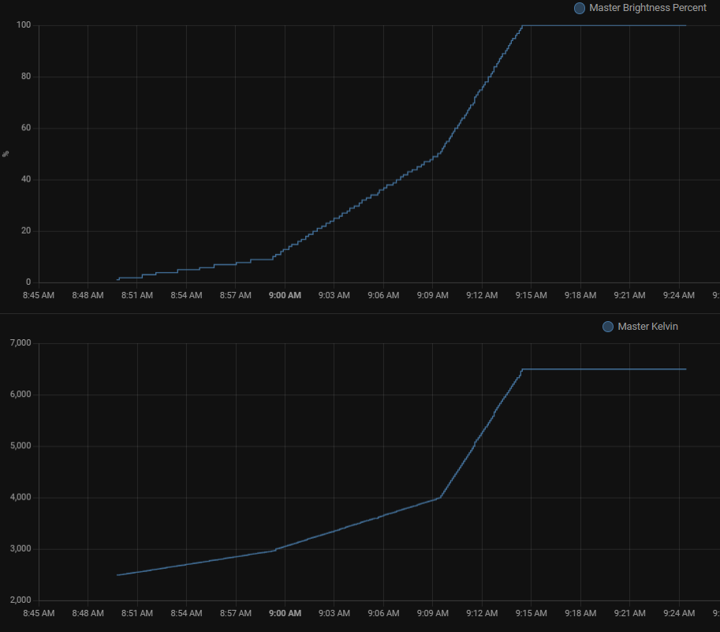

I wanted to try the sunrise effect for waking up in the morning and found the [blueprint](https://community.home-assistant.io/t/wake-up-light-alarm-with-sunrise-effect/255193/145) that would do this for me. However, this didn't work and was overly difficult to troubleshoot. It triggers every minute, and as I used to be a Systems Adminitrator, this unnecessary use of resources also bugged me. If you didn't catch the errors in the automation with in the number of available traces, it was gone. If you did manage to catch the trace, it was so convoluted that it was nearly impossible to troubleshoot unless you are intimately aware of the execution steps.  Not to mention the issues trying to trigger it with a date/time helper other then the the one integrated with the HA phone app.

I created my own script and automation to bypass the frustations above. It is not nearly as full featured as the blueprint but it is highly configureable. Basically it contains 2 components. The first component is a script that can be executed many times in series to change the rates of the 2 main settings, color temperature in kelvin and brightness. By running it many times in series you get get a more parabolic effect. I added this feature because I could visually detect changes in brightness more at lower values. Below is an example of this. You can see the points of which the values change. 

The second component is an blueprint that executes the script 3 times in series with different values for each execution. 

## Detailed Explaination of Script
The script expects to be kicked off with parameters defined. For the script to work, the target light needs to be and set to starting Kelvin values. The starting brightnes is always 1%. The blueprint handles the inital turning on of the light. The kelvin value of the light will be used as the starting value.

If you turn off the light at any point while the script is running, the script and blueprint will end.

The script also allows for defining how long to take to get from start to finish values and how many steps per minute to take to get there. The script will also turn off the light after the 'Light Timeout' period. Setting this value to 0 will disable the timeout, and this is how you can chain executions of the script together to get the desired parabolic curve effect.

## Detailed Explaination of Bluebrint

The bluebrint is much simpler. Execute the script 3 to get the desired parabolic curve. All executions of the script (except for the last one)  have the 'Light Timeout' set to 0 so that the script will continue from current values. It also checks light is off (for all executions but the first one) so that if you turn the light off, the subsequent executions of the script in the currently running automation will not turn it back on.

When setting up start time for the trigger you will need to take into account when you want it to finish. In my example below I want it to finish by 7:00 am, so I do the math backwards and start it at 6:35. The total time is solved by adding up all the 'Alarm Length' fields of all executions of the script.

In my automation I'm using the Workday Integration and its binary sensor to only execute on days I have configured in that integration.

## Installation
1. Copy and paste the script as is into a new script on your system when editing in YAML mode. 
1. Import the blueprint